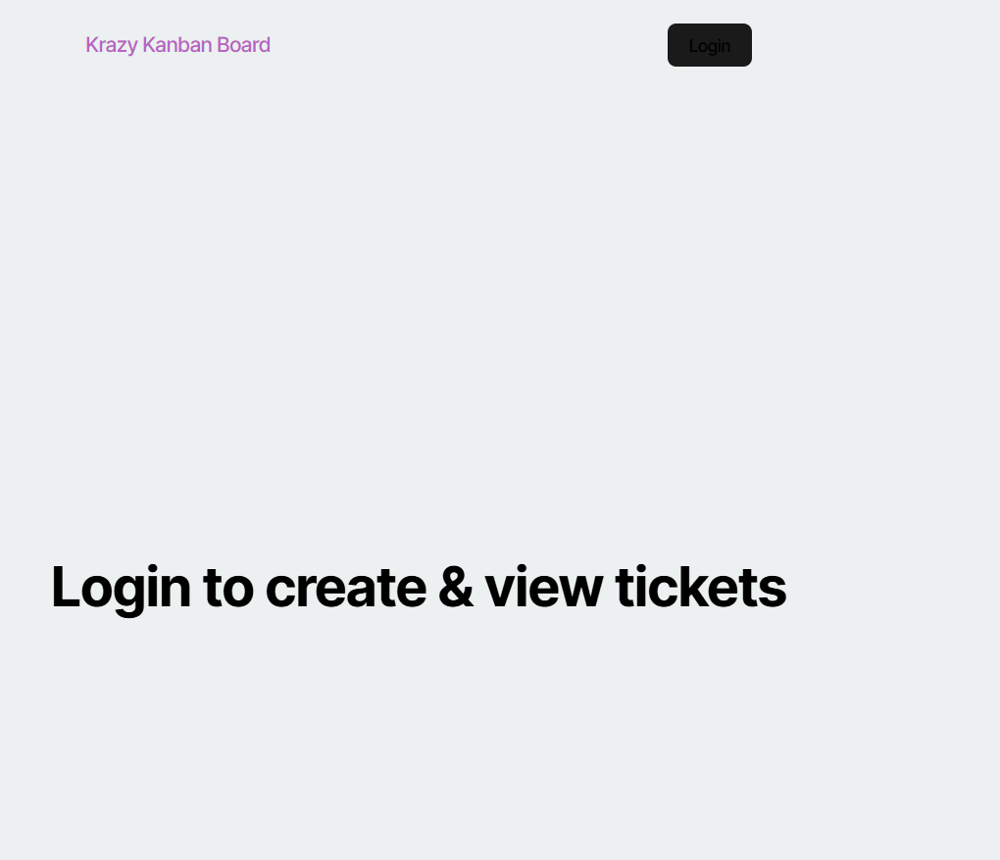
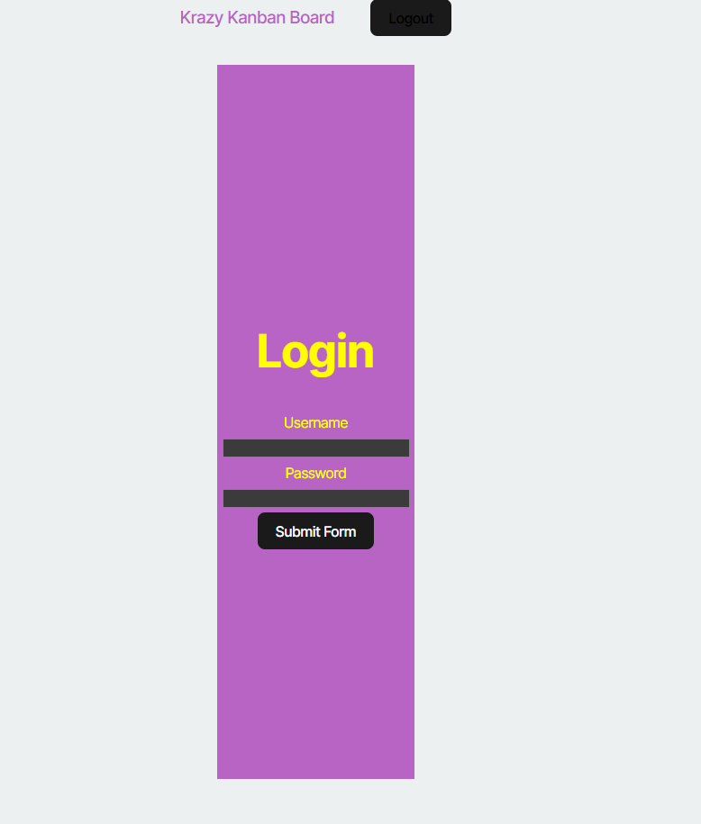
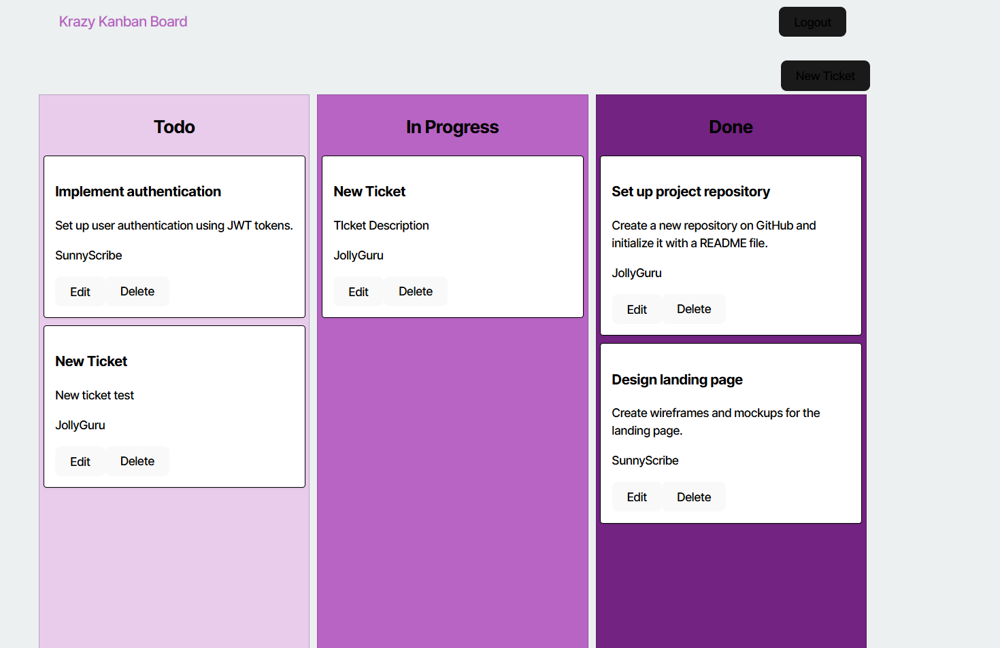
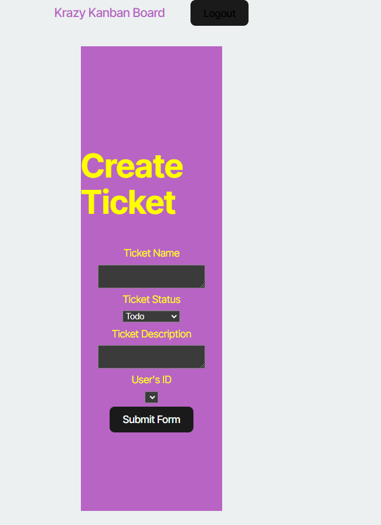

# Kanban Board

## Description
Kanban Board is project management tool that allows users to create new tasks and view progress on current ones. You will need to log in to and existing account to view the ticket board. Once you've logged in you can view, create, edit, or delete a ticket.

## Display

## Installation
N/A

## Usage
To use this app, click the login button and login to an existing account. Once you've successfully logged in you will be navigated to the board where you can view all the existing tickets. Click the create ticket button and fill in all the necessary information to create a new ticket. Once you're finished filling out the information click submit form. To edit and existing ticket, click the edit button on the ticket you want to edit. If you want to delete an existing ticket click the delete button on an existing ticket. Once you are ready to logout click the logout button at the top right corner and you will be directed to the login page again. To view this app, please visit the following link:

https://kanban-board-56n6.onrender.com

## Contributors
N/A

## License
N/A